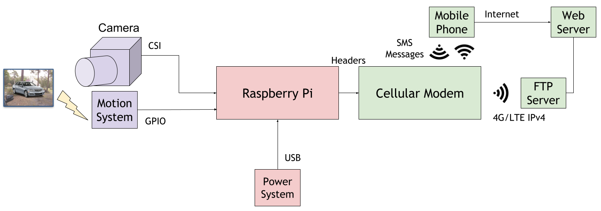
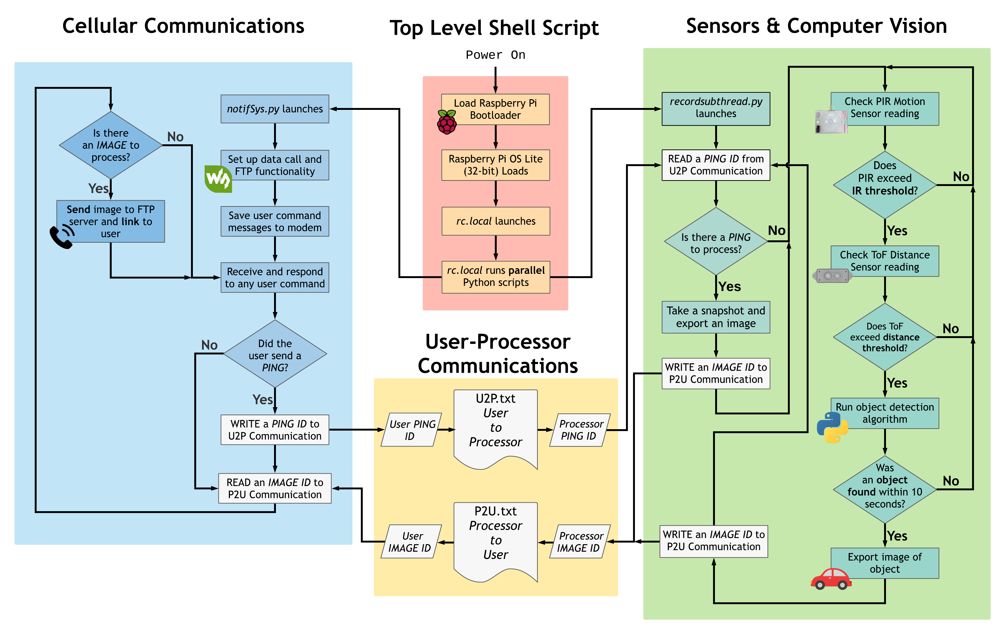

# wireless-driveway-security

This repository contains the source code for a wireless driveway security system, developed for homeowners without a direct line-of-sight property entryway. The system was built on two main motives:

- Desire for home security and homeowner peace of mind.
- Current long-distance devices lack logs and details on who has entered their property.

The system uses motion sensing and distance detection sensors which signal a camera module to record the object in view and capture an image using computer vision technologies. Once a proper image of the object is taken, it is sent to the homeowner's phone over 4G/LTE cellular connection.

# Top-Level Architecture

# Software Architecture

